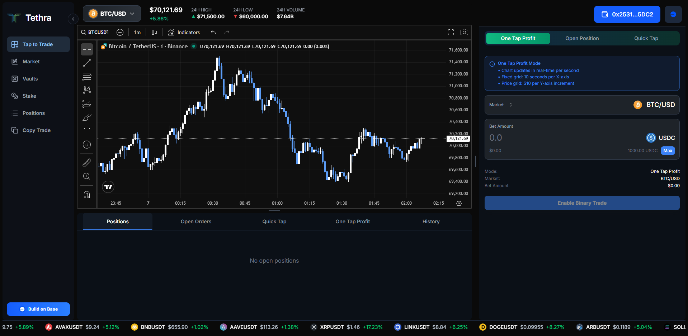

# Tethra DEX - Frontend




Modern, high-performance frontend for Tethra DEX perpetual futures trading platform.

## 🌟 Key Features

### Trading Interface

- 📈 **Real-time TradingView Charts** - Professional charting with Chainlink Price Feeds Oracle price overlay
- ⚡ **Instant Market Orders** - Execute trades immediately at oracle price
- 🎯 **Advanced Orders** - Limit orders, stop-loss, take-profit, grid trading
- 💎 **One Tap Profit and Quick Tap** - Short-term price prediction betting (30s-5min)
- 📊 **Real-time PnL** - Live profit/loss calculation
- 💰 **Multi-Asset Support** - Trade with crypto, forex, commodities, indices, stocks

### Wallet & Authentication

- 🔐 **Privy Integration** - Email/social login with embedded wallets
- 🐛 **Wagmi & Viem** - Modern Web3 React hooks
- 💵 **USDC Gas Payments** - Pay fees in USDC via Account Abstraction
- 🔗 **Base Network** - Built on Base L2 for low fees and fast transactions
- 🟦 **Base App** - Support login on Base App

### User Experience

- 🎨 **Modern UI/UX** - Sleek, responsive design with TailwindCSS
- 🌌 **3D Graphics** - Three.js powered visual effects
- 🔔 **Real-time Notifications** - Toast notifications for all actions
- 📱 **Mobile Responsive** - Optimized for all screen sizes
- ⚡ **Turbopack** - Fast development with Next.js 15

## 🚀 Quick Start

### Prerequisites

- Node.js 18+ installed
- npm or yarn package manager
- Privy App ID ([get one here](https://privy.io))
- Backend API running (see `tethra-be/README.md`)

### Installation

```bash
# Clone repository
git clone <your-repo-url>
cd tethra-dex/Tethra-Front-End

# Install dependencies
npm install

# Copy environment variables
cp .env.example .env

# Edit .env with your Privy App ID
nano .env
```

### Environment Configuration

Edit `.env` file:

```bash
# Privy Authentication
NEXT_PUBLIC_PRIVY_APP_ID=your_privy_app_id_here

# Backend API URLs
NEXT_PUBLIC_BACKEND_URL=http://localhost:3001
NEXT_PUBLIC_WS_URL=ws://localhost:3001

# Network
NEXT_PUBLIC_CHAIN_ID=84532
NEXT_PUBLIC_RPC_URL=https://sepolia.base.org

# Core contracts (copy from tethra-sc deployment)
NEXT_PUBLIC_USDC_TOKEN_ADDRESS=0x...
NEXT_PUBLIC_VAULT_POOL_ADDRESS=0x...
NEXT_PUBLIC_STABILITY_FUND_ADDRESS=0x...
NEXT_PUBLIC_MARKET_EXECUTOR_ADDRESS=0x...
NEXT_PUBLIC_LIMIT_EXECUTOR_ADDRESS=0x...
NEXT_PUBLIC_POSITION_MANAGER_ADDRESS=0x...
NEXT_PUBLIC_RISK_MANAGER_ADDRESS=0x...
NEXT_PUBLIC_TAP_TO_TRADE_EXECUTOR_ADDRESS=0x...
NEXT_PUBLIC_ONE_TAP_PROFIT_ADDRESS=0x...
NEXT_PUBLIC_TETHRA_TOKEN_ADDRESS=0x...
NEXT_PUBLIC_TETHRA_STAKING_ADDRESS=0x...
NEXT_PUBLIC_USDC_PAYMASTER_ADDRESS=0x...
NEXT_PUBLIC_DEPLOYER_ADDRESS=0x...
NEXT_PUBLIC_TREASURY_ADDRESS=0x...
NEXT_PUBLIC_PRICE_SIGNER_ADDRESS=0x...
```

### Development

```bash
# Start development server with Turbopack
npm run dev

# Open browser
# Navigate to http://localhost:3000
```

The app will hot-reload when you make changes.

### Build for Production

```bash
# Build optimized production bundle
npm run build

# Start production server
npm start

# Or preview production build
npm run build && npm start
```

### Vaults page notes

- Uses `NEXT_PUBLIC_VAULT_POOL_ADDRESS` and `NEXT_PUBLIC_STABILITY_FUND_ADDRESS`.
- Shows APY estimated from StabilityFund streams; ensure backend relayer calls `streamToVault()` periodically.
- `% Owned` uses on-chain shares vs total+virtual supply; deposit via contract to mint shares (avoid raw transfers).

## 📚 Project Structure

```
Tethra-Front-End/
├── src/
│   ├── app/                    # Next.js 15 App Router
│   │   ├── page.tsx            # Home page
│   │   ├── layout.tsx          # Root layout with providers
│   │   └── globals.css         # Global styles
│   ├── components/             # React components
│   │   ├── trading/            # Trading UI components
│   │   ├── wallet/             # Wallet connection
│   │   ├── charts/             # TradingView charts
│   │   └── ui/                 # Reusable UI components
│   ├── hooks/                  # Custom React hooks
│   ├── lib/                    # Utilities & helpers
│   ├── config/                 # Configuration files
│   └── types/                  # TypeScript types
├── public/                     # Static assets
├── .env.example                # Environment template
├── next.config.ts              # Next.js configuration
├── tailwind.config.ts          # TailwindCSS config
└── tsconfig.json               # TypeScript config
```

## 🛠️ Tech Stack

### Core Framework

- **Next.js 15** - React framework with App Router
- **React 19** - Latest React with concurrent features
- **TypeScript 5** - Type-safe development

### Web3 Integration

- **Privy** - Authentication & embedded wallets
- **Wagmi 2** - React hooks for Ethereum
- **Viem 2** - TypeScript Ethereum library
- **Ethers 6** - Ethereum interactions

### UI & Styling

- **TailwindCSS 4** - Utility-first CSS
- **Headless UI** - Unstyled, accessible components
- **Lucide React** - Icon library
- **React Hot Toast** - Notifications

### Charts & Graphics

- **Lightweight Charts** - TradingView charting library
- **Three.js** - 3D graphics
- **React Three Fiber** - React renderer for Three.js

### Data Fetching

- **TanStack Query** - Server state management
- **Axios** - HTTP client
- **WebSocket** - Real-time price updates

## 🖥️ Deployment Options

### Option 1: Vercel (Recommended)

Vercel provides the easiest deployment for Next.js apps:

1. **Push to GitHub**

   ```bash
   git init
   git add .
   git commit -m "Initial commit"
   git remote add origin <your-github-repo>
   git push -u origin main
   ```

2. **Connect to Vercel**

   - Visit [vercel.com/new](https://vercel.com/new)
   - Import your GitHub repository
   - Configure environment variables
   - Deploy!

3. **Environment Variables**
   Add these in Vercel dashboard:

   ```
   NEXT_PUBLIC_PRIVY_APP_ID=your_privy_app_id
   NEXT_PUBLIC_BACKEND_URL=https://api.yourdomain.com
   NEXT_PUBLIC_WS_URL=wss://api.yourdomain.com
   # ... all other env vars
   ```

4. **Custom Domain** (Optional)
   - Add custom domain in Vercel settings
   - Update DNS records
   - SSL is automatically configured

### Option 2: VPS Deployment

#### Prerequisites

- Ubuntu/Debian VPS (2GB RAM minimum)
- Node.js 18+ installed
- Domain name (optional)
- Nginx for reverse proxy

#### Step 1: Setup VPS

```bash
# Update system
sudo apt update && sudo apt upgrade -y

# Install Node.js 18+
curl -fsSL https://deb.nodesource.com/setup_18.x | sudo -E bash -
sudo apt install -y nodejs

# Install PM2
sudo npm install -g pm2

# Install Nginx
sudo apt install -y nginx
```

#### Step 2: Deploy Frontend

```bash
# Clone repository
cd /var/www
sudo git clone <your-repo-url> tethra-dex
cd tethra-dex/Tethra-Front-End

# Install dependencies
npm install

# Create .env file
sudo nano .env
# Add all production environment variables

# Build production bundle
npm run build
```

#### Step 3: Run with PM2

```bash
# Start with PM2
pm2 start npm --name "tethra-frontend" -- start

# Save PM2 config
pm2 save

# Enable startup on boot
pm2 startup
sudo env PATH=$PATH:/usr/bin pm2 startup systemd -u $USER --hp $HOME

# Check status
pm2 status
pm2 logs tethra-frontend
```

#### Step 4: Configure Nginx

Create Nginx config:

```bash
sudo nano /etc/nginx/sites-available/tethra-frontend
```

Add configuration:

```nginx
server {
    listen 80;
    server_name yourdomain.com www.yourdomain.com;

    location / {
        proxy_pass http://localhost:3000;
        proxy_http_version 1.1;
        proxy_set_header Upgrade $http_upgrade;
        proxy_set_header Connection 'upgrade';
        proxy_set_header Host $host;
        proxy_cache_bypass $http_upgrade;
        proxy_set_header X-Real-IP $remote_addr;
        proxy_set_header X-Forwarded-For $proxy_add_x_forwarded_for;
    }
}
```

Enable site:

```bash
# Create symlink
sudo ln -s /etc/nginx/sites-available/tethra-frontend /etc/nginx/sites-enabled/

# Test config
sudo nginx -t

# Restart Nginx
sudo systemctl restart nginx
```

#### Step 5: Setup SSL (HTTPS)

```bash
# Install Certbot
sudo apt install -y certbot python3-certbot-nginx

# Get SSL certificate
sudo certbot --nginx -d yourdomain.com -d www.yourdomain.com

# Test auto-renewal
sudo certbot renew --dry-run
```

#### Step 6: Configure Firewall

```bash
# Allow HTTP, HTTPS, SSH
sudo ufw allow 22/tcp
sudo ufw allow 80/tcp
sudo ufw allow 443/tcp
sudo ufw enable

# Check status
sudo ufw status
```

### Option 3: Static Export (Netlify/Cloudflare Pages)

For static hosting (note: some features may need adjustment):

```bash
# Build static export
npm run build

# The output will be in .next/ folder
# Upload to your static hosting provider
```

## 🔧 Maintenance & Updates

### Update Code

```bash
# Pull latest changes
cd /var/www/tethra-dex/Tethra-Front-End
sudo git pull

# Install new dependencies
npm install

# Rebuild
npm run build

# Restart PM2
pm2 restart tethra-frontend
```

### Monitor Performance

```bash
# View logs
pm2 logs tethra-frontend

# Monitor resources
pm2 monit

# Check status
pm2 status
```

### Troubleshooting

**Issue: Build fails**

```bash
# Clear cache and rebuild
rm -rf .next node_modules
npm install
npm run build
```

**Issue: Environment variables not working**

- Ensure all `NEXT_PUBLIC_` prefix is correct
- Rebuild after changing .env
- Check browser console for actual values

**Issue: Wallet connection fails**

- Verify Privy App ID is correct
- Check network configuration (Base Sepolia/Mainnet)
- Ensure backend API is accessible

**Issue: Charts not loading**

- Check WebSocket connection to backend
- Verify CORS settings on backend
- Check browser console for errors

## 📚 Learn More

- [Next.js Documentation](https://nextjs.org/docs)
- [Privy Documentation](https://docs.privy.io)
- [Wagmi Documentation](https://wagmi.sh)
- [TailwindCSS Documentation](https://tailwindcss.com/docs)
- [Lightweight Charts Documentation](https://tradingview.github.io/lightweight-charts/)

## 🔗 Important Links

- [Vercel Deployment](https://vercel.com/docs)
- [Base Network](https://base.org)
- [Base Sepolia Faucet](https://www.coinbase.com/faucets/base-ethereum-sepolia-faucet)
- [Privy Dashboard](https://dashboard.privy.io)

## 📝 License

MIT License - see LICENSE file for details

---

**Built with ❤️ by Tethra DEX Team**

For questions or support, please open an issue on GitHub.

